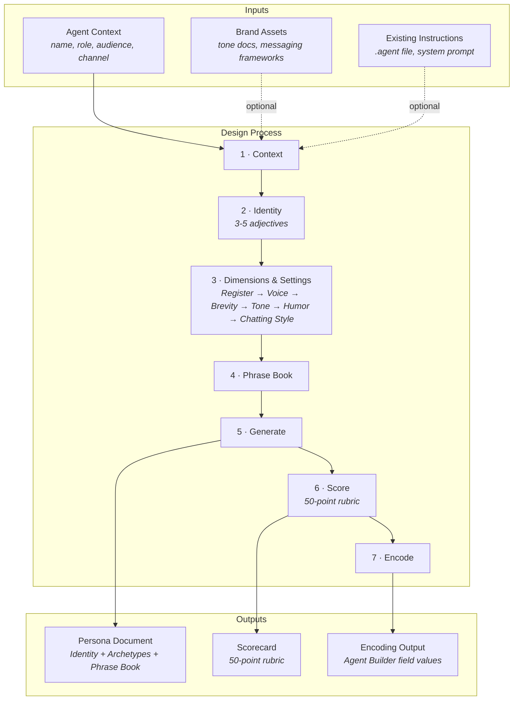

# Agent Persona Design Skill

Design AI agent personas for Salesforce Agentforce using the **Identity + Dimensions + Settings** framework.

Users assign personality to conversational agents within seconds. If you don't design that personality intentionally, users will invent one — often inconsistent, often unflattering.

This skill provides a structured framework for designing consistent, intentional agent personas for Salesforce Agentforce — from identity traits through encoding into Agent Builder fields.

## Quick Start

```
/sf-ai-agentforce-persona
```

The skill walks you through 7 steps:

1. **Context** — Agent name, role, audience, channel, use cases
2. **Identity** — 3-5 personality adjectives + optional backstory (proposed, you confirm)
3. **Dimensions & Settings** — Dependency-ordered: Register → Voice → Brevity → Tone (+Empathy Level, +Tone Boundaries) → Humor → Chatting Style (Emoji, Formatting, Punctuation, Capitalization)
4. **Phrase Book** — Dynamic phrase categories tuned to Voice + Tone + Brevity + Humor
5. **Generate** — Produces a filled persona document with sample interactions
6. **Score** — 50-point rubric with actionable feedback
7. **Encode** — Generates copy-paste-ready Agent Builder field values

## Output

Three Markdown files:
- **Persona document** (`generated/[agent-name]-persona.md`) — design artifact defining who the agent is
- **Scorecard** (`generated/[agent-name]-persona-scorecard.md`) — 50-point rubric evaluation
- **Encoding output** (`generated/[agent-name]-persona-encoding.md`) — Agent Builder field values, platform settings, and reusable instruction blocks

## Files

| File | Purpose |
|---|---|
| `SKILL.md` | Skill definition and workflow |
| `resources/persona-framework.md` | Identity + dimensions + settings reference |
| `resources/persona-encoding-guide.md` | How to encode persona into Agentforce Agent Builder |
| `templates/persona-template.md` | Persona document output template |
| `templates/persona-encoding-template.md` | Agent Builder encoding output template |
| `references/change-history.md` | Version history |

## Process Overview



> See `resources/persona-encoding-guide.md` for full field-by-field encoding guidance.

## Framework Overview

- **Identity** — 3-5 adjectives that anchor every decision
- **Register** — Subordinate / Peer / Advisor / Coach
- **Voice** — Formal / Professional / Conversational / Personable
- **Brevity** — Terse / Concise / Moderate / Expansive *(setting)*
- **Tone** — Clinical Analyst / Matter-of-Fact / Encouraging Realist
- **Empathy Level** — Minimal / Moderate / High *(setting, follows Tone)*
- **Humor** — None / Dry / Warm / Playful *(setting)*
- **Chatting Style** *(settings group)*
  - **Emoji** — None / Functional / Expressive
  - **Formatting** — Plain / Selective / Heavy
  - **Punctuation** — Conservative / Standard / Expressive
  - **Capitalization** — Standard / Casual
- **Tone Boundaries** — What the agent must never sound like *(authored within Tone)*

Dimensions are ordered by dependency — upstream choices constrain downstream ones. The persona document also includes a **Phrase Book** (example phrases tuned to Voice + Tone + Brevity + Humor + Chatting Style). Recovery & Escalation and Content Guardrails are defined in agent design.

## Version

v1.0 — See `references/change-history.md` for full version history.

## Contributing Upstream

This skill is designed for contribution to [jaganpro/sf-skills](https://github.com/jaganpro/sf-skills). Upstream validation: `python3 skill-builder/scripts/bulk_validate.py` (run in a fork of sf-skills). AI assistance must be disclosed in PR descriptions. See `CONTRIBUTING.md` for details.

## Acknowledgements

This framework synthesizes ideas from multiple published sources into an original persona design system for AI agents:

- **Conversation Design Institute (CDI)** — Foundational principles on why intentional persona design matters, including the pareidolia effect, register archetypes (via Leary's Interpersonal Circumplex), the "One Breath Test," tapering, and apology/acknowledgement guidelines
- **Nielsen Norman Group (NN/g)** — Research on voice and tone in UX writing, the distinction between voice (persistent) and tone (contextual), and usability heuristics that inform dimension boundaries
- **Google Conversation Design Guidelines** — Principles for persona definition, error handling patterns, and turn-taking in conversational interfaces
- **Amazon Alexa Design Guidelines** — Voice channel parameters (pitch, speaking rate, energy) and voice-specific persona considerations
- **Salesforce** — Agentforce platform architecture, Agent Builder field constraints, and Einstein Copilot design patterns that shape the encoding guide

## License

MIT — see `LICENSE`.
